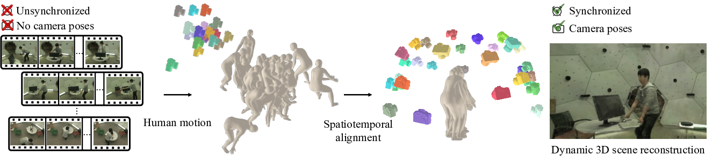

# Humans as a Calibration Pattern

 
 

 
Official implementation of <b>Humans as a Calibration Pattern: Dynamic 3D Scene Reconstruction from Unsynchronized and Uncalibrated Videos, ICCV 2025</b>.

## 
Code will be released soon!
